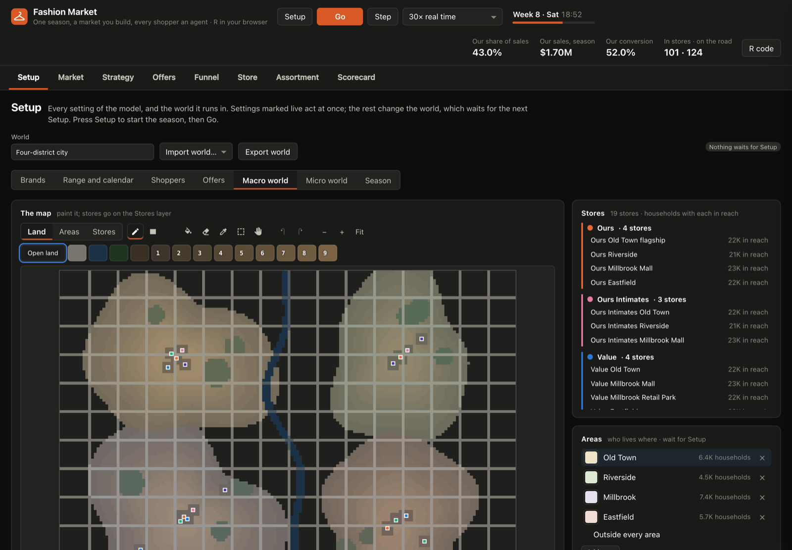
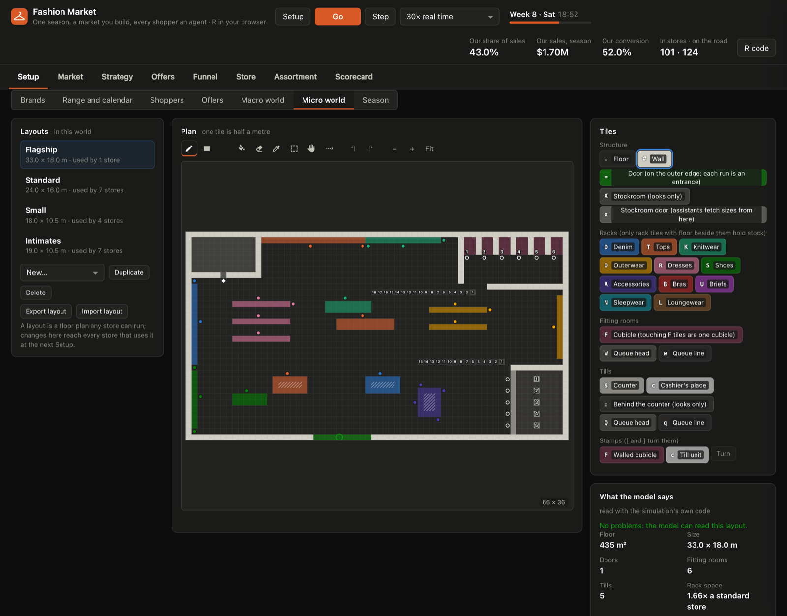

# Fashion Market

An agent-based model of one season of fashion retail, in a market you
build, running in your browser.

Brands, grouped into families, run stores on a map you paint. Each brand
sells its own range on its own calendar of promotions, markdowns and
replenishment. Every day, each household decides whether to shop, where,
and what to take off the rack. Inside each store, shoppers walk a floor you
paint, queue for fitting rooms and pay at tills staffed by cashiers, while
sales assistants work the floor.


The app opens on a default world: five brands in four families run
nineteen stores across a city of four areas and 24,000 households. Every
part of it can be changed on the Setup tab, exported as a world file and
imported again.

Watch the whole market at once, click any store to watch its floor, and
click any shopper or worker there to see inside their head. It is all one
simulation: every number on every tab is a sum of what individual agents
did.

The model is written in R and runs in the page through
[webR](https://docs.r-wasm.org/webr/), with
[NetLogoR](https://cran.r-project.org/package=NetLogoR). There's no server,
no install and no account. The **R code** button shows the files that are
running, and the world they run in.

---

## The questions it answers

| Question | Where to look | What to change on the Setup tab |
|---|---|---|
| How many cashiers and assistants does a store need on a Saturday afternoon? What do too few cost in walk-outs, and too many in wages? | Store, Funnel | a store's staffing, scan and try-on times, queue limits |
| How much revenue is lost because the shopper's size isn't on the rack, and how much does allocating stock by each store's own size mix win back? | Assortment, Funnel | size allocation (flat or learned), the season's buy, lead time |
| How often should a brand replenish, and by which rule? What does ordering twice a week, or sending more stock at launch, cost in deliveries and leftover stock, against what it wins in sizes found? | Assortment, Scorecard | the calendar's replenishment entries (when, which products, top up to cover with a reorder point, or replace what sold); the opening allocation, lead time, logistics fees and salvage value |
| What does a price cut or a promotion do to our share? A category promotion against one on the whole range, members only against everyone, one area against the whole market? Whose share does it take, and what does it do to margin? | Market, Strategy, Scorecard | a brand's price change and marketing; its calendar's promotions (which products, when, how deep, which tiers and areas); the promotion buttons on the Market tab |
| When should a product be marked down? What's the trade-off between sell-through and margin, and should promotions also come off marked-down prices? | Assortment, Scorecard | the calendar's markdowns (planned windows or a recurring review; every product or only those behind plan; to a set depth or a step deeper); the price rules (the sell-through target, and whether promotions apply to marked-down products) |
| What does a rival's range do to us: its prices, its categories, when its new lines land? | Market, Strategy, Assortment | a brand's range: its products, their prices and costs, the day each lands (typed in, or pasted from a spreadsheet) |
| What did an offer add, against the households held out? Is a coupon to loyal customers worth what it gives away? When our coupon is also good at a sister brand, where does the extra spend go? Who kept their loyalty tier, who moved up, who dropped? | Offers | each brand's offers on its calendar (name, days, coupon, cost to send, audience, holdout, tiers and areas reached, where it's good); each tier's starting share of households and the season's spend that earns it |
| Where should a new store go? Which households does the market leave stranded, out of every store's reach? | Setup (Macro world) | the stores (made in the Micro world), where they stand on the map, its areas, each segment's radius |
| What does a different floor plan do to queues, walks and sales? | Store, Scorecard | a layout (Micro world) |
| Where do we lose shoppers between walking in and paying, and why? | Funnel | nothing: the tab's own filters (brand, area, store, period) |

---

## The tabs

Build and set everything on **Setup**, press **Setup** to start the season,
then **Go**. The same world and seed always give the same season. Settings
marked *live* act the moment they change, even mid-season. Everything else
changes the world, and waits for the next Setup; the Setup button counts
the changes waiting. Setup checks a world before starting it. If anything
is wrong, it lists every problem where it is, and the season carries on in
the world set up before.

### Setup

The world's name, **Import world** (the default, or a file), **Export
world**, and seven sections:

- **Brands.** Brands in their families (exactly one family is ours), each
  with its price change, marketing, staffing, stock rules and plan by
  category, its taste by segment, and its loyalty tiers: the share of
  households that starts in each, and the season's spend that earns it.
- **Range and calendar.** Each brand's products: name, category, list
  price, cost, and the day it lands in the stores. Rows can be added,
  duplicated, removed, or pasted from a spreadsheet. The calendar is a
  Gantt chart: promotions as named bars, replenishment as bands with a tick
  on each order day, markdowns as shaded steps to the season's end with a
  tick on each day they act, and landing days as diamonds. Each entry is
  edited in a panel beside the chart that says in one line what it does.
  Below are the price rules: the sell-through target, and whether
  promotions come off marked-down prices. The model checks the range and
  calendar as they're edited and shows each problem in red.
- **Shoppers.** The categories (name, colour, the key their racks are
  painted with, whether they're tried on, their typical price); the
  segments (how they shop, how far they'll travel, their taste for each
  category, and their hidden response to offers); and the market-wide
  weights.
- **Offers.** Each brand's named coupons on its calendar (an email, a
  mailing, whatever the brand calls them). Each has its days, discount and
  cost to send; the share of the households it reaches that it's sent to
  (drawn at random), and the share of those held out; the tiers and areas
  it reaches; and the brands where it's good.
- **Macro world.** The market map, painted in tiles: land, roads, bridges,
  water, parks, shops, and homes by density. Its named areas and the
  make-up of their households. Where each store stands: on the Stores
  layer, pick a store and click the map to place it, or drag it to move
  it; a block of land moved with the select tool takes its stores with it.
  As you paint, the model places the households and routes every trip the
  way Setup would, and reports how many households there are, how many
  have no store in reach, and how many have each store in reach. Parks and
  shops only look different: trips cross them like open land. Resizing or
  moving land never deletes a store; one taken off the map waits until
  it's placed again.
- **Micro world.** The stores and their layouts, described below.
- **Season.** Its length in days, and the seed.



#### Micro world: stores and layouts

A store is a name, a brand and a layout (its floor plan), with its own
staffing and service. A brand's stores can run different layouts. A new
store isn't on the map until the Macro world's Stores layer places it, and
Setup says so until then.

Layouts are painted in half-metre tiles: floor, walls, doors, the stockroom
and its doors, racks in the world's categories, fitting-room cubicles, and
tills, each with its queue. Two tools save drawing these by hand:

- The **queue tool** (U) drags a queue out from its head: one head and a
  single line joined to it, replacing the old queue.
- **Stamps** put down a walled cubicle or a till unit whole. [ and ] turn
  them.

**Rack faces set capacity.** A rack tile with floor beside it is a face: a
place where a shopper can reach the stock. A store's space for a category
is that category's faces, measured against a standard store's, and it sets
how much of the category the store plans to sell and puts on the floor.
Racks buried inside a block, and racks of a category the brand doesn't
sell, hold nothing.

The model reads a layout as you paint and lists its problems: no door, a
door inside the plan, a queue not joined to its head, racks with no floor
beside them, places shoppers can't walk to. When there are none, it reports
the floor area; the doors, fitting rooms and tills; queue places against
the stores' queue limits; rack tiles, faces and places to stand for each
category; rack space against a standard store; the longest walk from a
door; and how long a fetch from the stockroom takes. On the plan it marks
what it read: the doors; the places to stand at each category's racks; the
cubicles and tills, numbered in the order staff open them; each queue's
places, in order; where assistants fetch from the stockroom; and, hatched,
racks with no floor beside them. Layouts can be exported and imported one
at a time.



#### Editing tools

Both editors share the same tools: pencil, rectangle, line, fill, eraser,
eyedropper, select and move, undo and redo, canvas size, zoom and pan. Hold
**Shift** with the rectangle to draw only its edge, such as a room's walls
in one stroke. Lines and pencil strokes step side to side, never corner to
corner, so a road, bridge or corridor joins up the way trips and shoppers
move: neither cuts a corner. Undo also covers where stores stand, the map's
areas, and the staff a layout stroke took from the stores running it.

The world being edited is kept in the browser, so a reload loses nothing.
**Import world → Default world** puts the default back.

### Market

The map: households coloured by the brand they last bought from (or by
segment, offer held, or area), stores in their brand's colour, and
shoppers driving the fastest route to and from them. Alongside it are a
global promotion button for each brand and a local promotion pad in each
area. Each adds a promotion to the brand's calendar, starting tomorrow, and
is greyed out, saying why, while a promotion it would overlap is on. Below
are one household's latent preference (its tier with each brand, the
stores in its reach, the offers it holds) and charts of customers, sales
share, revenue and weekly revenue.

### Strategy

Our family's levers as bars beside the competitors' average. Market share
over time as a stacked area (addressable, ours, other brands). Revenue,
spend per customer and average receipt by week, and each segment's share
of wallet.

### Offers

Each brand's offers, measured against their holdouts: who got the offer,
on the map (held out, sent, used it); spend per household sent against
held out, day by day; every offer's lift with its 95% interval, its extra
sales, and its extra margin after the cost of sending; the extra spend by
tier; and where that spend came from (the brand itself, the other brands
its coupon is good at, its sister brands, its competitors, and the net for
our family). Below are the brand's loyalty tiers: by the tier each
household started in, who has kept theirs, who has moved up, and who
hasn't re-qualified yet (dropped, at the season's end), and where the
season's spend puts them.


### Funnel

In market → visited → picked items → past the fitting rooms → kept → paid,
with losses by reason above each stage, a dot for each shopper at each
stage right now, and the assistant and cashier teams.

### Store

Any store's floor, live: racks by category (racks of a category the brand
doesn't sell stand empty), shoppers coloured by what they're doing, and
staff. There are three views: the floor, a footfall heat map, and the
process flow with counts. Click a shopper and the inspector shows what
they're doing, their basket and patience, why they came, their tier with
the brand, the promotions that reach them, and their visit in the first
person. Each thought's tone comes from how close the decision was; hover
over one to see the numbers behind it. Click a cashier or an assistant to
see their work. The tab also has the store's KPIs, queue and utilisation
charts, and "follow a shopper".


### Assortment

Each brand's calendar, as the season has run it and as it's planned:
promotions; markdowns, each past day saying how many products it took and
why it left the others; replenishment, each past order day with the units
sent and the day they arrive; and products landing. Also the brand's
products through their lifecycle (on order, full price, markdown,
clearance, sold through), sizes on the floor, sell-through against weeks
of cover, where the stock is, the brand's stock rules as its calendar and
settings define them, and a product table.

### Scorecard

Satisfied and unsatisfied visits and why, time in store with its
statistics, staff utilisation, the size fill rate, where each brand's
money went (logistics and, at the season's end, its leftover stock written
down), and a CSV export of the daily results.

---

## How the model works

**The world** (`model/world.R`) is one JSON document: the season's length,
the categories, the map with its areas and household make-up, the
layouts, the stores, the families and brands (each with its range,
calendar, stock settings and price rules), the segments, and the market's
weights. `world_check()` lists every problem in a file, with where it is;
`world_install()` sets the tables the simulation reads. How people behave
is the model, and stays in `model/params.R`. The default world is
`worlds/default.world.json`; its four layouts are prefab files in
`layouts/`, in the format the layout editor writes.

Older files are upgraded as they're read or imported, a version at a time:

- Version 1 (one fixed catalogue for every brand) gets categories and
  ranges.
- Version 2 (every brand replenished on Mondays, and marked down by a
  Sunday review outside the calendar) gets those rules written as calendar
  entries, so it runs the season it ran.
- Version 3 (a plan for every category, sold or not) keeps each brand's
  plan for the categories it sells.
- Version 4 (stores chosen without regard to what their brands sell) gets
  the market's weight for what a store's brand sells, set to 1; a world
  where every brand sells every category runs as it did.
- Version 5 (loyalty tiers earned by paid visits, and offers run as a
  programme outside the calendar) gets tiers earned by spend, set to match
  the old climb at the brand's typical price, and its programme, if it was
  on, as one coupon offer on the calendar for the whole season, with a
  quarter of its audience held out.

**Ranges** (`model/stock.R`). Categories belong to the world: shoppers want
a category ("I'm after denim"), layouts have racks for categories, and
reports compare brands category by category. Each brand's range is its
own: products in the categories it chooses, each with a list price, a
cost, and the day it lands. How well a product will sell is hidden, drawn
from the seed at Setup. A brand's price position (the middle of its list
prices against each category's typical price, times its price change) is
what a household weighs when choosing a store.

**The calendar** (`model/calendar.R`). A promotion takes a share off the
whole range, some categories or chosen products, from its first day to its
last, for the tiers and areas it reaches. A product has at most one
promotion on any day for any household; Setup refuses a calendar that
breaks this, naming both promotions, the product and the days.

Replenishment and markdown entries act on chosen days (once, or on some
weekdays between two dates), in the morning before opening, on the stock
and sales up to the night before. A product takes at most one entry of
each kind a day; Setup refuses a calendar that breaks this, naming both
entries, the product and the day.

A markdown applies to the products it's on: every one, or only those
behind plan (sold through less than the brand's target times the share of
their planned sales due by then, less some points, once they've been in
the stores long enough to judge). It takes them to a depth off full price,
or a step deeper, and holds to the season's end. The deeper markdown
always wins, so a markdown never raises a price, and a product marked down
recently can be left to rest. Each markdown's day is recorded: how many
products it took, and why it left the others.

A product's price on a day, to a shopper at the rack, is its list price ×
the brand's price change, less its markdown, less the promotion reaching
the shopper (on a marked-down product, only if the brand's promotions come
off marked-down prices), less the household's coupon, if it holds one good
there.

**The macro world** (`model/city.R`) is a painted map of tiles, a NetLogoR
world. Households are placed on home tiles in proportion to their density,
each taking a segment, a size and a budget from the area it lives in (or
the map's default make-up). Every trip follows the fastest route across the
map: at road speed on roads and bridges, slower elsewhere, and never over
water (`model/grid.R` works out every store's routes at Setup). A household
only weighs the stores within its radius: its segment's radius, in route
distance, stretched brand by brand by its loyalty tier with the brand.

**The micro world** (`model/floors.R`). Each layout is a picture of
half-metre tiles, read into a NetLogoR world: the places shoppers stand,
and the walking routes between them (the same routing as the map). A rack
tile with floor beside it is a face. A store's space for a category is
that category's faces against a standard store's faces, shared evenly
among the categories its brand sells; it sets how much of the category the
store plans to sell and puts on the floor. Racks deep in a block, and racks
of what the brand doesn't sell, hold nothing.

**A day** (`model/market.R`):

1. Each household with a store in reach is in the market for clothes with a
   chance that depends on its segment, the weekday, the point in the
   season, how much budget is left, the promotions that reach it (by how
   much of each brand's range in the stores they cover), marketing, and any
   offers it holds.
2. A household in the market weighs every store in its reach against
   staying home, using a multinomial logit. A store's appeal is the sum of:
   the household's taste for the brand; what the brand sells (its racks for
   the categories the household's segment likes: a brand selling none of
   them is never chosen); the pull of the household's loyalty tier with the
   brand; its price sensitivity (smaller, the more loyal it is) times the
   brand's price position, less what its promotions take off; promotions
   and marketing; the trip; memory of bad visits (no size, a queue walked
   out of); word of mouth in its neighbourhood; the store's layout; and any
   offers good at the brand.
3. It drives there along the fastest route, and home again afterwards.
4. After closing, loyalty moves (`model/loyalty.R`): what a household paid
   adds to its season's spend with the brand, and a household whose spend
   reaches a higher tier moves up to it. It keeps its tier to the season's
   end, when it stands where the season's spend puts it.

**In the store** (`model/store.R`), the shopper browses the racks of the
categories their segment favours, among those the brand sells. At each rack
they pick the product that appeals most (their taste on the day, its hidden
popularity, its price that day against the category's typical price, the
pull of a markdown), if it clears the bar, they can afford it, and it's on
the rack in their size. If it isn't on the rack, a free assistant may fetch
it from the stockroom: finding it takes two and a quarter minutes, plus the
walk from the rack to the nearest stockroom door and back. Shoppers join
the fitting-room queue, or balk if it's too long, then try items on in a
cubicle (entered from the floor at its opening; no one walks through one)
and keep some. Then they queue at the tills, or walk out if the queue is
too long. A store with several doors lets shoppers in by each, in
proportion to its width, and out by the nearest. Every visit ends in
exactly one of seven recorded outcomes, and every job a cashier or an
assistant does is recorded with who did it.

**Stock** (`model/stock.R`). Each brand buys its season up front, from its
plan (by category, shared among the category's products in the stores each
week), and holds it at a distribution centre (DC). Each product lands in
the stores on its own day, and each store then gets the brand's opening
allocation (weeks of planned sales). After that, a store is replenished
only by its brand's calendar. Each replenishment entry either tops each
store up to some weeks of expected demand beyond the lead time (for each
size under a reorder point), or ships what sold since the product's last
order. A store's demand estimate (units sold, plus those asked for in a
size that wasn't there) covers the seven days to the night before, blended
with the estimate made on the same weekday a week earlier. Orders arrive
after the lead time, split by size either flat (the market's size curve)
or learned (the store's own demand by size).

Logistics are charged as stock leaves the DC: a fee for each unit, and a
fee for each store delivery (a store has one delivery on each day stock
arrives for it). At the season's end, leftover stock is written down to
its salvage value. Bargain hunters come out in proportion to the share of
products on the racks at half price or less. Every unit bought is accounted
for: sold, on a rack, in a stockroom, being reshelved, on its way, or at
the DC.

**Offers** (`model/offers.R`). On an offer's first morning, its audience is
drawn at random from the households it reaches (by their tier with the
brand and where they live), and a random share of that audience is held
out. The rest are sent the coupon, at a cost each. It's good for one
purchase until the offer's last day, at the brand and at any other brand
it names (a sister brand, say). A household holding one is more likely to
shop and more drawn to those brands, by its segment's hidden response
times its tier's, fading as a brand sends it more. Every purchase an
audience household makes during the offer, at any brand, is logged against
the offer, and the reports measure the offer from that log alone: those
sent against those held out.

**What shoppers think** (`model/events.R`). The model logs each visit's
story as it happens, each event with the numbers that decided it. One table
gives, for every event, what it carries, its line in the follow-a-shopper
log, and the shopper's thought; for how a visit ended, it also gives the
funnel stage where the shopper is lost. A thought's tone comes from how
close the decision was: a product that cleared the bar easily or only
just, a price just out of reach or far above it, a queue left at the limit
of the shopper's patience or long before. A pick is an impulse buy, and
reads as one, when the chance of taking anything from that rack was under
one in five (before their taste on the day, among everything in the stores
they could afford). Every sentence names the brand's own products.

### One clock for walking and for a season

A shopper spends 10–40 minutes in a store, and a season in the default
world lasts 13 weeks. So every activity gets its exact start and end time
when it begins, and the simulation advances in one-minute steps. Within
each step it settles, in time order, everything that competes: who took
the last size M, and who joined the queue first. The minimum stop at a rack
is also a minute, so no shopper's decisions can fall out of order.

What's drawn is placed from those exact times, at whatever speed you watch.
The header's **Speed** runs store time from real time (1×) to 3,600× (1/30
of a second to 120 seconds of store time per frame); the map shows every
shopper on the road, and the floor every shopper in the store. The fastest
setting runs a market day per tick without drawing them. Drawing never
draws random numbers, so **the same seed gives the same season at any
speed**, and the tests check this. A change made mid-day, such as a cashier
added at 14:00, acts from that moment on.

### Speed

| Measurement | Time |
|---|---|
| The default world in webR: Setup | about 0.6 s (the whole boot, R included, about 5 s) |
| The default world in webR: a market day (about 3,500 visits to 19 stores) | about 0.5 s at the fastest speed |
| The largest world (24 brands, 80 stores, 60,000 tiles, 60,000 households), native R | Setup 1.9 s, a market day 0.39 s (about 10,000 visits); webR runs R about 3–4 times slower |
| A 120 × 80 layout, read and routed, native R | 0.1 s |

Those are the largest a world can be: 24 brands, 80 stores, 12 segments, 6
tiers a brand, 40 areas, a map of 60,000 tiles, 60,000 households, and
layouts up to 120 × 80 tiles (60 × 40 m).

Two measurements shaped the code. With NetLogoR's dependencies loaded,
`nrow()` and `ncol()` become S4 generics, and dispatch costs more than the
work, so the hot code uses `dim()`. Per-step overhead dominates in webR, so
the step is a minute and only shoppers inside a store are scanned. The
routing grows each store's routes outward from the store, roughly in order
of travel time, a band at a time, so the default map of 19,200 tiles
routes its 19 stores in a tenth of a second natively.

---

## Architecture

```
page (js/fashion/)                              worker (workers/sim.worker.js)
  app.js          tabs, header, run controls      webR + NetLogoR (vfs/ image)
  world-store.js  the draft and installed worlds  model/*.R, sourced in order
  tabs/*.js       one module per tab        ⇄     world_load(), setup(), go(), set_*(), reports
  grid-editor.js  the editors' shared canvas ◀─   GEOMETRY  the installed world, its map and floors
  map-editor.js   the macro world            ◀─   FRAME     packed doubles, every tick (acknowledged)
  layout-editor.js the micro world           ◀─   REPORT    JSON for the visible tab, 1–4 times a second
  inspector.js    inside a head              ◀─   HOMES     household colours, when they change
  city-view.js, floor-view.js, charts.js     ─▶   SET / ACTION / VIEW / SETUP / RUN / PAUSE
                                             ─▶   CHECK_WORLD / PREVIEW_MACRO / CHECK_LAYOUT
```

- R owns every number, and every check of a world. The page only draws and
  edits the draft.
- Only what's on screen is computed. The worker packs the floor only for
  the store being viewed, and builds only the visible tab's report.
- Settings and actions reach R as quoted values through a fixed list of
  calls (`workers/sim.worker.js`); worlds and layouts reach it as files in
  its filesystem. Page input is never code.

---

## Run it locally

You need R with the `httpuv` package.

```bash
Rscript tools/serve.R
```

Then open <http://localhost:8123/>. The first visit downloads about 17 MB
(the R runtime and the NetLogoR library), which the browser then caches.
`tools/serve.R` sends the COOP/COEP headers that let webR use its fastest
channel.

## Publish it

The app is static files. Everything of its own (scripts, the worker,
styles, the model, worlds, layouts and the NetLogoR image) is loaded by a
relative path, so it runs from any subpath, such as
`username.github.io/repository/`; only webR comes from its CDN. GitHub
Pages can't send the COOP/COEP headers, so `coi-serviceworker.js`, the
first script `index.html` loads, installs a service worker that adds them,
and reloads the page once.
`.nojekyll` makes Pages serve every file as it is.

## Tests

```bash
Rscript tools/test-fashion.R          # 14 season days and 3 watched days
Rscript tools/test-fashion.R 91 5     # a whole season
```

The test runs the model headless in local R and checks that:

- every visit ends in exactly one outcome, no wait is negative, and no
  till, fitting room or assistant serves two shoppers at once
- sales equal the sum of receipts, and every unit is accounted for every
  day
- every household stays on its loyalty ladders, in the highest tier its
  season's spend has reached (never below where it started), and every
  visit is to a store within the household's reach
- every decision is taken in time order, and the season's visit log adds
  up to the season's sales
- every report builds and serialises, and each funnel stage is no bigger
  than the one before it
- a cashier added at 14:00 serves from 14:00 on, and not before
- the same seed gives identical days at season pace and at watch pace,
  with frames drawn between ticks
- shoppers on the road stay on the map, and every trip runs from the home
  to the store
- drawn floors work as drawn: a fetch walks to the stockroom door and
  back, a shopper tries on inside the cubicle, a cubicle is never a
  corridor, every door is a way in and out, every block of racks has a
  place to stand, and rack space is the faces a shopper can reach
- the default world, exported and imported again, is the same world; each
  prefab layout reads back identical, with no problems; and a broken world
  lists every problem where it is
- a 16-brand world (32 stores, 30,000 households) on a drawn map, with a
  drawn layout, runs a week, its time printed
- every event logged in a day has its line and its thought, and each
  thought's tone follows the decision (an impulse buy reads as one)
- a store whose layout has no racks for something its brand sells is
  refused; a brand with its own range (its own categories, one of them
  new, products and prices, some landing mid-season) runs a week, and its
  shoppers browse only what it sells; a segment never goes to a brand that
  sells nothing it likes
- two promotions on one product on one day for the same households are
  refused, naming both, the product and the days; in different areas
  they're allowed
- a product's price on a day follows the rules, with and without
  promotions on marked-down products, and with a coupon
- replenishment entries order on their days only; "replace what sold"
  ships each store exactly what it sold since the last order; a Thursday
  order's estimate runs to Wednesday night; and the logistics charged are
  the fees for the deliveries and units that left the DC
- two markdown or two replenishment entries acting on one product on one
  day are refused, naming both, the product and the day
- a markdown behind plan takes only the products behind plan, and a
  markdown never raises a price
- an offer's audience and holdout are the shares asked for, no household
  held out gets a coupon, each coupon is used once, sending is charged on
  the day it goes, and broken offers and tiers are refused
- older worlds upgrade and run: the version 1 default world
  (`tools/fixtures/v1-world`) runs the season the version 1 model ran,
  identical by day and outcome (its floor plans' old tables kept as they
  were for this check), and the version 2 and version 5 default worlds
  (`tools/fixtures/v2-default.world.json`,
  `tools/fixtures/v5-default.world.json`) upgrade and run

It needs NetLogoR installed against the shims in `tools/.cache/rlib` (see
`tools/check-templates.R`). `npm test` runs it along with the rest of the
repository's tests.

---

## What's real and what's illustrative

Everything in the default world is illustrative: the city, its four areas,
the brands (named by position: Ours, Ours Intimates, Value, Premium, Fast),
their ranges, the shoppers, the offers and every number. Each behaviour is
either a setting in the world or a named constant with a comment in
`model/params.R`. There's no external or licensed data. The logistics fees
($150 a store delivery, $0.40 a unit shipped) and the salvage value of
stock left at the season's end (20% of cost) are assumptions, not sourced
figures. Rent and overheads are left out of contribution.

## Files

| Path | What it holds |
|---|---|
| `index.html`, `css/fashion.css`, `js/fashion/` | the page |
| `coi-serviceworker.js` | cross-origin isolation on hosts that can't send the headers, and a cache for the large downloads |
| `workers/sim.worker.js` | the webR session and the run loop |
| `model/` | the model, in R (`index.json` gives the order; `events.R` is what's said about a visit, `calendar.R` the calendar and its markdowns, `stock.R` replenishment) |
| `worlds/default.world.json` | the world the app opens with |
| `layouts/` | the four prefab layouts (`index.json` lists them) |
| `vfs/` | the pre-built NetLogoR library image for webR (`tools/build-vfs.R`) |
| `tools/serve.R` | the local server |
| `tools/build-default-world.R` | how the default world was made from the city the model used to generate |
| `tools/test-fashion.R` | the headless test, with its older worlds in `tools/fixtures/` |
| `screenshots/` | the images in this README |

The earlier NetLogoR Workbench (the interface language, its editor and its
presets) is still in the repository (`js/main.js` and the modules it loads,
`workers/engine.worker.js`, `r/workbench.R`, `templates/`), but it isn't
part of this app.
