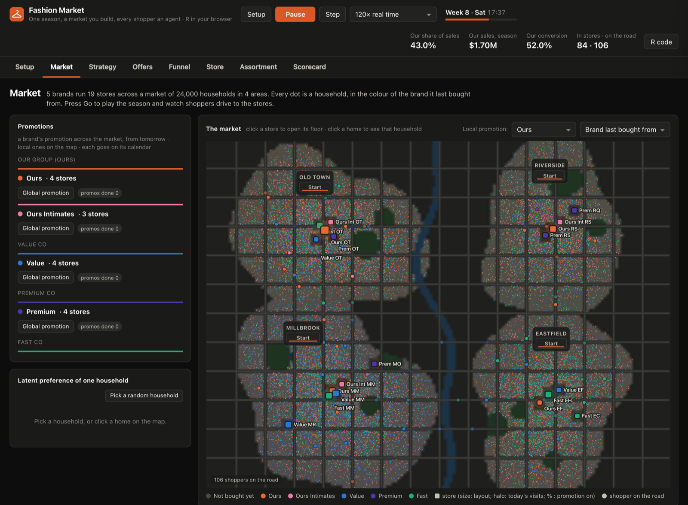
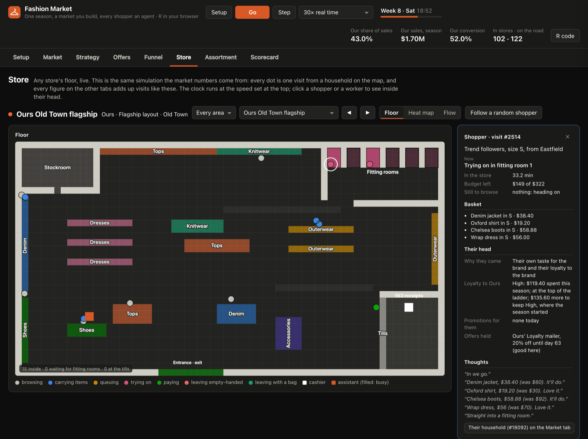
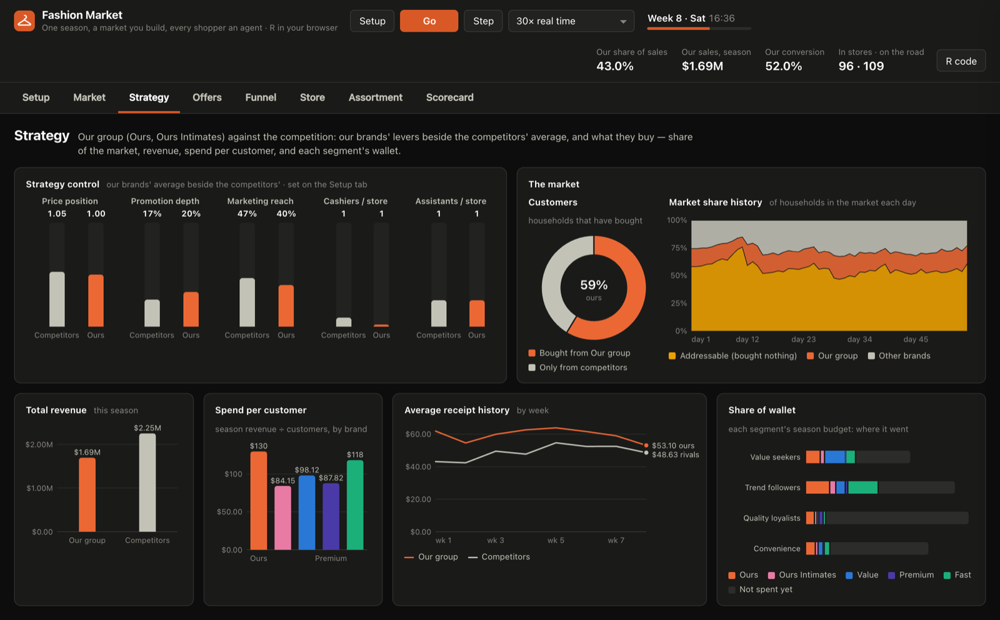
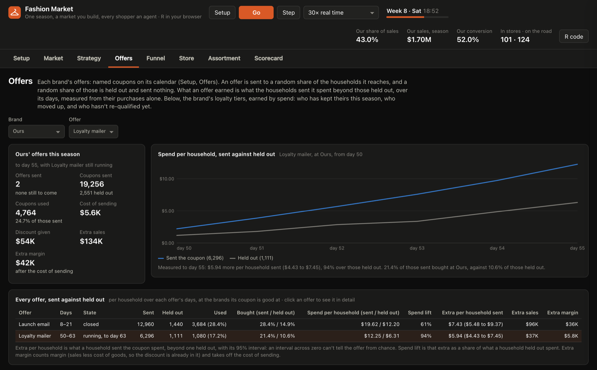
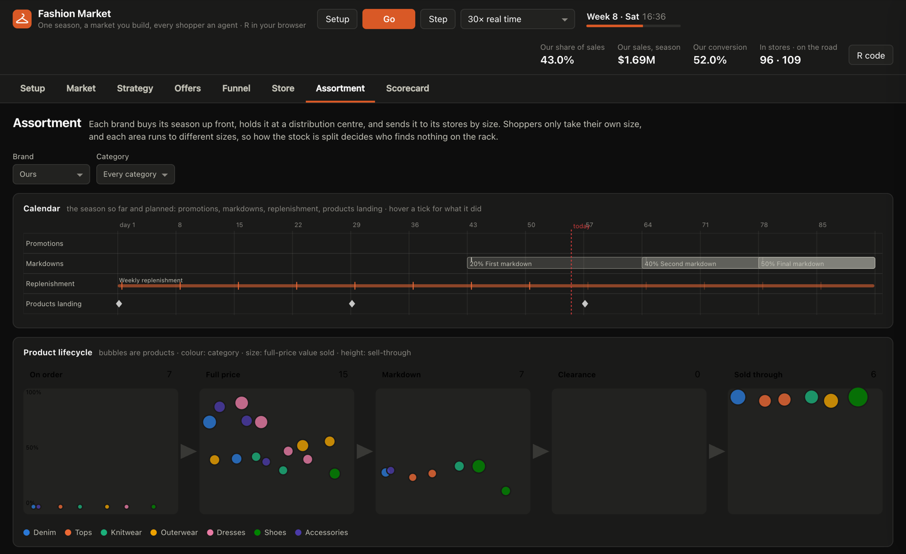
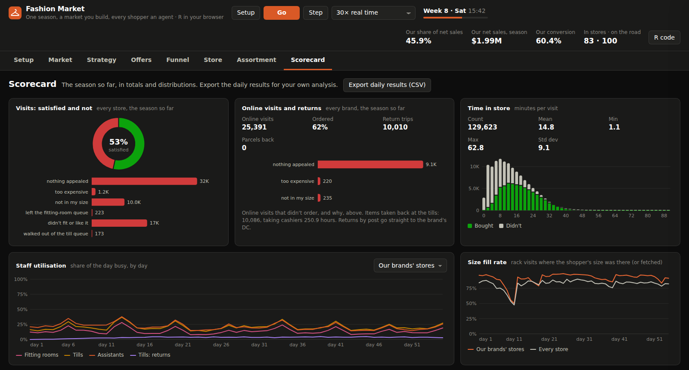

# Fashion Market

**A season of fashion retail, simulated one shopper at a time, in your browser.**

Test staffing, size allocation, replenishment, markdowns, promotions and
offers against a market you build, and see what each is worth in sales,
margin and share.

**[Open the app](https://8139causal.github.io/fashion-market/)** · no
install, no account, no server · [What it answers](#what-it-answers) ·
[Quick start](#quick-start) · [How it works](#how-it-works) ·
[Run it locally](#run-it-locally)



Every day, each household decides whether to shop, which store to visit and
what to take off the rack. In the store, shoppers walk the floor, look for
their size, queue for fitting rooms and pay at staffed tills. Every number
on every report is a sum of those decisions, so any KPI can be followed down
to the shoppers behind it, and any shopper can be opened to see why they did
what they did.

You set the market: the brands, their ranges and calendars, the shoppers,
the city map and every store's floor plan. The same world and seed always
give the same season, so two runs differ only by what you changed.

The model is R, running in the page through
[webR](https://docs.r-wasm.org/webr/) and
[NetLogoR](https://cran.r-project.org/package=NetLogoR). The **R code**
button shows the files that are running, and the world they run in.

---

## What it answers

| Decision | The question | Change on Setup | Read on |
|---|---|---|---|
| Staffing | How many cashiers and assistants does a Saturday afternoon need? What do too few cost in walk-outs, and too many in wages? | a store's staffing, scan and try-on times, queue limits | Store, Funnel, Scorecard |
| Size allocation | How much revenue is lost because the shopper's size isn't on the rack, and how much does allocating by each store's own size mix win back? | size allocation (flat or learned), the season's buy, lead time | Assortment, Funnel |
| Replenishment | Weekly or twice a week? Top up to cover, or replace what sold? What does each cost in deliveries and leftover stock, against what it wins in sizes found? | replenishment entries on the calendar, opening allocation, lead time, logistics fees, salvage value | Assortment, Scorecard |
| Markdowns | When to mark down, how deep, and everything or only what's behind plan? Should promotions also come off marked-down prices? | markdown entries on the calendar, sell-through target, price rules | Assortment, Scorecard |
| Promotions and price | A category or the whole range? Members or everyone? One area or the whole market? Whose share does it take, and what does it do to margin? | promotions on the calendar, a brand's price change and marketing | Market, Strategy, Scorecard |
| Offers and loyalty | What did a coupon add, against the households held out? When it's also good at a sister brand, where does the extra spend go? Who kept their tier, who moved up, who dropped? | offers on the calendar (audience, holdout, tiers and areas reached, where it's good); each tier's starting share and qualifying spend | Offers |
| Competition | What do a rival's prices, categories and launch dates do to us? | a brand's range: products, prices, costs, the day each lands | Market, Strategy, Assortment |
| Store network | Where should the next store go? Which households have no store in reach? | where stores stand on the map, its areas, each segment's travel radius | Setup (Macro world) |
| Floor plan | What does a different layout do to queues, walks and sales? | a layout (Micro world) | Store, Scorecard |
| Conversion | Where are shoppers lost between walking in and paying, and why? | nothing: filter by brand, area, store and period | Funnel |

---

## Quick start

1. **[Open the app](https://8139causal.github.io/fashion-market/).** The
   first visit downloads about 17 MB (R and the NetLogoR library), which the
   browser then caches. It opens on the default world: five brands in four
   families running 19 stores across a city of four areas and 24,000
   households, over a 13-week season.
2. **Press Go.** The speed menu runs store time from real time to 3,600×,
   or *Fastest*: a market day per tick, without drawing.
3. **Click any store** on the map to watch its floor, then **click a
   shopper** to see their basket, their loyalty and their thoughts.
4. **Change something.** Settings marked *live* act at once, even
   mid-season. Anything that changes the world waits for **Setup**, which
   counts the changes waiting. Setup checks the world first; if anything is
   wrong, it lists every problem where it is, and the season carries on in
   the world set up before.
5. **Export world** saves the whole market as one JSON file, to share or
   import later.

---

## The tour

### Market

The whole market at once (above): households coloured by the brand they last
bought from (or by segment, offer held, or area), stores in their brand's
colour, and shoppers driving the fastest route there and back. Beside the
map, the promotions running today, brand by brand; each brand's calendar
sets them (Setup → Range and calendar). Click a home to see that
household's latent preference: its tier with each brand, the stores in its
reach, the offers it holds.

### Store



Any store's floor, live, as the floor, a footfall heat map or the process
flow with counts. Click a shopper to see what they're doing, their basket
and patience, why they came, their tier with the brand, the promotions and
offers that reach them, and their visit in the first person. Each thought's
tone comes from how close the decision was; hover over it for the numbers
behind it. Click a cashier or an assistant to see their work, or follow a
random shopper through their visit.

### Strategy



Our family against the competition: our levers beside the competitors'
average, market share over time (addressable, ours, other brands), revenue,
spend per customer, average receipt by week, and each segment's share of
wallet.

### Offers



Every offer measured against a random holdout: spend per household sent
against held out, day by day; each offer's lift with its 95% interval, its
extra sales, and its extra margin after the cost of sending; the extra spend
by tier; and where it came from (the brand, the other brands its coupon is
good at, its sister brands, its competitors, and the net for our family).
Below, the loyalty tiers: who kept theirs, who moved up, and who hasn't
re-qualified yet.

### Assortment



Each brand's calendar, as run and as planned: promotions; markdowns, each
past day saying how many products it took and why it left the others;
replenishment, each order with the units sent and the day they arrive; and
products landing. Below it, products through their lifecycle (on order, full
price, markdown, clearance, sold through), sizes on the floor, sell-through
against weeks of cover, where the stock is, and a product table.

### Scorecard



Satisfied and unsatisfied visits and why, time in store, staff utilisation,
the size fill rate, each brand's path from full-price value to contribution
(markdowns and promotions, cost of goods, staff, marketing, offers,
logistics, and stock written down at the season's end), and a CSV export of
the daily results.

### Funnel

In market → visited → picked items → past the fitting rooms → kept → paid,
with each stage's losses by reason (stayed home, went to another store,
nothing appealed, too expensive, not in my size, didn't fit or like it, a
queue too long), a dot for each shopper at each stage right now, and the assistant and
cashier teams. Filter by brand, area, store and period.

---

## Build your market

Everything is set on the **Setup** tab, in seven sections:

- **Brands.** Families (exactly one is ours) and their brands, each with its
  price change, marketing, staffing, stock rules, plan by category, taste by
  segment, and loyalty tiers: the share of households that starts in each,
  and the season's spend that earns it.
- **Range and calendar.** Each brand's products (name, category, list price,
  cost, the day it lands), typed in or pasted from a spreadsheet. The
  calendar is a Gantt chart of promotions, replenishment, markdowns and
  landing days, each entry edited in a panel that says in one line what it
  does. Problems show in red as you edit.
- **Shoppers.** The categories; the segments (how they shop, how far they'll
  travel, their taste for each category, their hidden response to offers);
  and the market-wide weights.
- **Offers.** Each brand's named coupons: days, discount, cost to send, the
  share of households reached that it's sent to and the share of those held
  out, the tiers and areas it reaches, and the brands where it's good.
- **Macro world.** The city, painted in tiles: roads, bridges, water, parks,
  shops, and homes by density; named areas with their household make-up; and
  where each store stands (pick a store on the Stores layer and click the
  map, or drag it). As you paint, the model places the households,
  routes every trip, and reports how many households each store has in
  reach, and how many have none.
- **Micro world.** The stores and their floor plans, painted in half-metre
  tiles: walls, doors, the stockroom, racks by category, fitting-room
  cubicles, and tills with their queues. The **queue tool** drags a queue
  out from its head; **stamps** put down a walled cubicle or a till unit
  whole. The model reads the plan as you paint: it lists problems (no door,
  a queue not joined to its head, racks no one can reach) and reports the
  floor area, fitting rooms, tills, rack space against a standard store, and
  the longest walk from a door. A new store goes on the map from the Macro
  world's Stores layer. Layouts export and import one at a time.
- **Season.** Its length in days, and the seed.

**Rack faces set capacity.** A rack tile with floor beside it is a face. A
store's space for a category is that category's faces against a standard
store's, and sets how much of the category it plans to sell and puts on the
floor. Racks buried in a block, or of a category the brand doesn't sell,
hold nothing.

Both editors share pencil, rectangle (Shift for its edge only), line, fill,
eraser, eyedropper, select and move, undo and redo, canvas size, zoom and
pan. The draft is kept in the browser, so a reload loses nothing, and
**Import world → Default world** puts the default back.

---

## How it works

Each part of the model is one R file in `model/`. Open a heading for the
mechanics.

<details>
<summary><b>The world</b>: one JSON document, checked before it runs (<code>model/world.R</code>)</summary>

The world holds the season's length, the categories, the map with its areas
and household make-up, the layouts, the stores, the families and brands
(each with its range, calendar, stock settings and price rules), the
segments, and the market's weights. `world_check()` lists every problem in a
file, with where it is; `world_install()` sets the tables the simulation
reads. How people behave is the model, and stays in `model/params.R`. The
default world is `worlds/default.world.json`; its four layouts are prefab
files in `layouts/`, in the format the layout editor writes.

Older files are upgraded as they're read or imported, a version at a time:

- Version 1 (one fixed catalogue for every brand) gets categories and
  ranges.
- Version 2 (every brand replenished on Mondays, and marked down by a Sunday
  review outside the calendar) gets those rules written as calendar entries,
  so it runs the season it ran.
- Version 3 (a plan for every category, sold or not) keeps each brand's plan
  for the categories it sells.
- Version 4 (stores chosen without regard to what their brands sell) gets
  the market's weight for what a store's brand sells, set to 1; a world
  where every brand sells every category runs as it did.
- Version 5 (loyalty tiers earned by paid visits, and offers run as a
  programme outside the calendar) gets tiers earned by spend, set to match
  the old climb at the brand's typical price, and its programme, if it was
  on, as one coupon offer on the calendar for the whole season, with a
  quarter of its audience held out.
- Version 6 (a promotion depth for each brand and a promotion length for
  the market, used only by the Market tab's promotion buttons) loses both
  settings: the buttons have gone, and promotions are set on the calendar.
  It runs the season it ran.

</details>

<details>
<summary><b>The city</b>: households on a painted map, trips on the fastest route (<code>model/city.R</code>, <code>model/grid.R</code>)</summary>

The macro world is a painted map of tiles, a NetLogoR world. Households are
placed on home tiles in proportion to their density, each taking a segment,
a size and a budget from the area it lives in (or the map's default
make-up). Every trip follows the fastest route across the map: at road speed
on roads and bridges, slower elsewhere, and never over water. Parks and
shops only look different: trips cross them like open land. `model/grid.R`
works out every store's routes at Setup, growing them outward from the
store, roughly in order of travel time. A household only weighs the stores
within its radius: its segment's radius, in route distance, stretched brand
by brand by its loyalty tier with the brand.

</details>

<details>
<summary><b>Store floors</b>: half-metre tiles read into walkable routes (<code>model/floors.R</code>)</summary>

Each layout is a picture of half-metre tiles, read into a NetLogoR world:
the places shoppers stand, and the walking routes between them (the same
routing as the map). A rack tile with floor beside it is a face. A store's
space for a category is that category's faces against a standard store's
faces, shared evenly among the categories its brand sells; it sets how much
of the category the store plans to sell and puts on the floor. A store with
several doors lets shoppers in by each, in proportion to its width, and out
by the nearest.

</details>

<details>
<summary><b>A day in the market</b>: who shops, where, and why (<code>model/market.R</code>, <code>model/loyalty.R</code>)</summary>

1. Each household with a store in reach is in the market for clothes with a
   chance that depends on its segment, the weekday, the point in the season,
   how much budget is left, the promotions that reach it (by how much of
   each brand's range in the stores they cover), marketing, and any offers
   it holds.
2. A household in the market weighs every store in its reach against staying
   home, using a multinomial logit. A store's appeal is the sum of: the
   household's taste for the brand; what the brand sells (its racks for the
   categories the household's segment likes: a brand selling none of them
   is never chosen); the pull of the household's loyalty tier with the
   brand; its price sensitivity (smaller, the more loyal it is) times the
   brand's price position, less what its promotions take off; promotions and
   marketing; the trip; memory of bad visits (no size, a queue walked out
   of); word of mouth in its neighbourhood; the store's layout; and any
   offers good at the brand.
3. It drives there along the fastest route, and home again afterwards.
4. After closing, loyalty moves: what a household paid adds to its season's
   spend with the brand, and a household whose spend reaches a higher tier
   moves up to it. It keeps its tier to the season's end, when it stands
   where the season's spend puts it.

</details>

<details>
<summary><b>In the store</b>: racks, sizes, fitting rooms and tills (<code>model/store.R</code>)</summary>

The shopper browses the racks of the categories their segment favours, among
those the brand sells. At each rack they pick the product that appeals most
(their taste on the day, its hidden popularity, its price that day against
the category's typical price, the pull of a markdown), if it clears the bar,
they can afford it, and it's on the rack in their size. If it isn't on the
rack, a free assistant may fetch it from the stockroom: finding it takes two
and a quarter minutes, plus the walk from the rack to the nearest stockroom
door and back. Shoppers join the fitting-room queue, or balk if it's too
long, then try items on in a cubicle and keep some. Then they queue at the
tills, or walk out if the queue is too long. Every visit ends in exactly one
of seven recorded outcomes, and every job a cashier or an assistant does is
recorded with who did it.

</details>

<details>
<summary><b>Ranges, calendars and prices</b>: promotions, markdowns, and the price at the rack (<code>model/stock.R</code>, <code>model/calendar.R</code>)</summary>

Categories belong to the world: shoppers want a category ("I'm after
denim"), layouts have racks for categories, and reports compare brands
category by category. Each brand's range is its own: products in the
categories it chooses, each with a list price, a cost, and the day it lands.
How well a product will sell is hidden, drawn from the seed at Setup. A
brand's price position (the middle of its list prices against each
category's typical price, times its price change) is what a household weighs
when choosing a store.

A promotion takes a share off the whole range, some categories or chosen
products, from its first day to its last, for the tiers and areas it
reaches. A product has at most one promotion on any day for any household;
Setup refuses a calendar that breaks this, naming both promotions, the
product and the days.

Replenishment and markdown entries act on chosen days (once, or on some
weekdays between two dates), in the morning before opening, on the stock
and sales up to the night before. A product takes at most one entry of each
kind a day; Setup refuses a calendar that breaks this, naming both
entries, the product and the day.

A markdown applies to every product it's on, or only those behind plan (sold
through less than the brand's target times the share of their planned sales
due by then, less some points, once they've been in the stores long enough
to judge). It takes them to a depth off full price, or a step deeper, and
holds to the season's end. The deeper markdown always wins, so a markdown
never raises a price, and a product marked down recently can be left to
rest. Each markdown's day is recorded: how many products it
took, and why it left the others.

A product's price on a day, to a shopper at the rack, is its list price ×
the brand's price change, less its markdown, less the promotion reaching the
shopper (on a marked-down product, only if the brand's promotions come off
marked-down prices), less the household's coupon, if it holds one good
there.

</details>

<details>
<summary><b>Stock and replenishment</b>: the season's buy, the DC, and every unit accounted for (<code>model/stock.R</code>)</summary>

Each brand buys its season up front, from its plan (by category, shared
among the category's products in the stores each week), and holds it at a
distribution centre (DC). Each product lands in the stores on its own day,
and each store then gets the brand's opening allocation (weeks of planned
sales). After that, a store is replenished only by its brand's calendar.
Each replenishment entry either tops each store up to some weeks of expected
demand beyond the lead time (for each size under a reorder point), or ships
what sold since the product's last order. A store's demand estimate (units
sold, plus those asked for in a size that wasn't there) covers the seven
days to the night before, blended with the estimate made on the same weekday
a week earlier. Orders arrive after the lead time, split by size either flat
(the market's size curve) or learned (the store's own demand by size).

Logistics are charged as stock leaves the DC: a fee for each unit, and a fee
for each store delivery (one on each day stock arrives for a store). At the
season's end, leftover stock is written down to its salvage value. Bargain
hunters come out in proportion to the share of products on the racks at half
price or less. Every unit bought is accounted
for: sold, on a rack, in a stockroom, being reshelved, on its way, or at the
DC.

</details>

<details>
<summary><b>Offers</b>: random audiences, random holdouts, measured from purchases alone (<code>model/offers.R</code>)</summary>

On an offer's first morning, its audience is drawn at random from the
households it reaches (by their tier with the brand and where they live),
and a random share of that audience is held out. The rest are sent the
coupon, at a cost each. It's good for one purchase until the offer's last
day, at the brand and at any other brand it names (a sister brand, say). A
household holding one is more likely to shop and more drawn to those brands,
by its segment's hidden response times its tier's, fading as a brand sends
it more. Every purchase an audience household makes during the offer, at any
brand, is logged against the offer, and the reports measure the offer from
that log alone: those sent against those held out.

</details>

<details>
<summary><b>What shoppers think</b>: every decision logged with the numbers behind it (<code>model/events.R</code>)</summary>

The model logs each visit's story as it happens, each event with the numbers
that decided it. One table gives, for every event, what it carries, its line
in the follow-a-shopper log, and the shopper's thought; for how a visit
ended, it also gives the funnel stage where the shopper is lost. A thought's
tone comes from how close the decision was: a product that cleared the bar
easily or only just, a price just out of reach or far above it, a queue left
at the limit of the shopper's patience or long before. A pick is an impulse
buy, and reads as one, when the chance of taking anything from that rack was
under one in five (before their taste on the day, among everything in the
stores they could afford). Every sentence names the brand's own products.

</details>

<details>
<summary><b>One clock</b>: the same seed gives the same season at any speed</summary>

A shopper spends 10–40 minutes in a store, and a season in the default world
lasts 13 weeks. So every activity gets its exact start and end time when it
begins, and the simulation advances in one-minute steps. Within each step it
settles, in time order, everything that competes: who took the last size M,
and who joined the queue first. The minimum stop at a rack is also a minute,
so no shopper's decisions can fall out of order.

What's drawn is placed from those exact times, at whatever speed you watch.
Drawing never draws random numbers, so the same seed gives the same season at
any speed, and the tests check this. A change made mid-day, such as a
cashier added at 14:00, acts from that moment on.

</details>

### What's real and what's illustrative

Everything in the default world is illustrative: the city, its four areas,
the brands (named by position: Ours, Ours Intimates, Value, Premium, Fast),
their ranges, the shoppers, the offers and every number. Each behaviour is
either a setting in the world or a named constant with a comment in
`model/params.R`. There's no external or licensed data. The logistics fees
($150 a store delivery, $0.40 a unit shipped) and the salvage value of stock
left at the season's end (20% of cost) are assumptions, not sourced figures.
Rent and overheads are left out of contribution.

### Performance

| Measurement | Time |
|---|---|
| Default world in webR: boot, R included | about 5 s |
| Default world in webR: Setup | about 0.6 s |
| Default world in webR: a market day (about 3,500 visits to 19 stores) | about 0.5 s at the fastest speed; a 13-week season in under a minute |
| Largest world (24 brands, 80 stores, 60,000 tiles, 60,000 households), native R | Setup 1.9 s, a market day 0.39 s (about 10,000 visits); webR runs R about 3–4 times slower |
| A 120 × 80 layout, read and routed, native R | 0.1 s |

Those are the largest a world can be: 24 brands, 80 stores, 12 segments, 6
tiers a brand, 40 areas, a map of 60,000 tiles, 60,000 households, and
layouts up to 120 × 80 tiles (60 × 40 m).

Two measurements shaped the code. With NetLogoR's dependencies loaded,
`nrow()` and `ncol()` become S4 generics, and dispatch costs more than the
work, so the hot code uses `dim()`. Per-step overhead dominates in webR, so
the step is a minute and only shoppers inside a store are scanned.

---

## Run it locally

You need R with the `httpuv` package.

```bash
Rscript tools/serve.R
```

Then open <http://localhost:8123/>. `tools/serve.R` sends the COOP/COEP
headers that let webR use its fastest channel.

### Publish it

The app is static files. Everything of its own (scripts, the worker, styles,
the model, worlds, layouts and the NetLogoR image) is loaded by a relative
path, so it runs from any subpath, such as `username.github.io/repository/`;
only webR comes from its CDN. GitHub Pages can't send the COOP/COEP headers,
so `coi-serviceworker.js`, the first script `index.html` loads, installs a
service worker that adds them, and reloads the page once. `.nojekyll` makes
Pages serve every file as it is.

### Tests

```bash
Rscript tools/test-fashion.R          # 14 season days and 3 watched days
Rscript tools/test-fashion.R 91 5     # a whole season
```

The test runs the model headless in local R and checks its accounting (every
visit ends in one outcome, every unit is accounted for every day, sales equal
receipts), its determinism (the same seed gives identical days at season
pace and at watch pace), and every rule a world can break. It needs
NetLogoR installed against the shims in `tools/.cache/rlib` (see
`tools/check-templates.R`). `npm test` runs it along with the rest of the
repository's tests.

<details>
<summary><b>Everything the test checks</b></summary>

- every visit ends in exactly one outcome, no wait is negative, and no till,
  fitting room or assistant serves two shoppers at once
- sales equal the sum of receipts, and every unit is accounted for every day
- every household stays on its loyalty ladders, in the highest tier its
  season's spend has reached (never below where it started), and every
  visit is to a store within the household's reach
- every decision is taken in time order, and the season's visit log adds up
  to the season's sales
- every report builds and serialises, and each funnel stage is no bigger
  than the one before it
- a cashier added at 14:00 serves from 14:00 on, and not before
- the same seed gives identical days at season pace and at watch pace, with
  frames drawn between ticks
- shoppers on the road stay on the map, and every trip runs from the home
  to the store
- drawn floors work as drawn: a fetch walks to the stockroom door and back,
  a shopper tries on inside the cubicle, a cubicle is never a corridor,
  every door is a way in and out, every block of racks has a place to stand,
  and rack space is the faces a shopper can reach
- the default world, exported and imported again, is the same world; each
  prefab layout reads back identical, with no problems; and a broken world
  lists every problem where it is
- a 16-brand world (32 stores, 30,000 households) on a drawn map, with a
  drawn layout, runs a week, its time printed
- every event logged in a day has its line and its thought, and each
  thought's tone follows the decision (an impulse buy reads as one)
- a store whose layout has no racks for something its brand sells is
  refused; a brand with its own range (its own categories, one of them new,
  products and prices, some landing mid-season) runs a week, and its
  shoppers browse only what it sells; a segment never goes to a brand that
  sells nothing it likes
- two promotions on one product on one day for the same households are
  refused, naming both, the product and the days; in different areas
  they're allowed
- a product's price on a day follows the rules, with and without promotions
  on marked-down products, and with a coupon
- replenishment entries order on their days only; "replace what sold" ships
  each store exactly what it sold since the last order; a Thursday order's
  estimate runs to Wednesday night; and the logistics charged are the fees
  for the deliveries and units that left the DC
- two markdown or two replenishment entries acting on one product on one day
  are refused, naming both, the product and the day
- a markdown behind plan takes only the products behind plan, and a markdown
  never raises a price
- an offer's audience and holdout are the shares asked for, no household
  held out gets a coupon, each coupon is used once, sending is charged on
  the day it goes, and broken offers and tiers are refused
- older worlds upgrade and run: the version 1 default world
  (`tools/fixtures/v1-world`) runs the season the version 1 model ran,
  identical by day and outcome (its floor plans' old tables kept as they
  were for this check), and the version 2 and version 5 default worlds
  (`tools/fixtures/v2-default.world.json`,
  `tools/fixtures/v5-default.world.json`) upgrade and run; the version 6
  default world (`tools/fixtures/v6-default.world.json`) upgrades and runs
  the season the version 6 model ran (`tools/fixtures/v6-season.json`),
  identical by day and outcome, and in sales and units by brand

</details>

### Architecture

```
page (js/fashion/)                              worker (workers/sim.worker.js)
  app.js          tabs, header, run controls      webR + NetLogoR (vfs/ image)
  world-store.js  the draft and installed worlds  model/*.R, sourced in order
  tabs/*.js       one module per tab        ⇄     world_load(), setup(), go(), set_*(), reports
  grid-editor.js  the editors' shared canvas ◀─   GEOMETRY  the installed world, its map and floors
  map-editor.js   the macro world            ◀─   FRAME     packed doubles, every tick (acknowledged)
  layout-editor.js the micro world           ◀─   REPORT    JSON for the visible tab, 1–4 times a second
  inspector.js    inside a head              ◀─   HOMES     household colours, when they change
  city-view.js, floor-view.js, charts.js     ─▶   SET / ACTION / VIEW / SETUP / RUN / PAUSE
                                             ─▶   CHECK_WORLD / PREVIEW_MACRO / CHECK_LAYOUT
```

- R owns every number, and every check of a world. The page only draws and
  edits the draft.
- Only what's on screen is computed. The worker packs the floor only for the
  store being viewed, and builds only the visible tab's report.
- Settings and actions reach R as quoted values through a fixed list of
  calls (`workers/sim.worker.js`); worlds and layouts reach it as files in
  its filesystem. Page input is never code.

### Files

| Path | What it holds |
|---|---|
| `index.html`, `css/fashion.css`, `js/fashion/` | the page |
| `coi-serviceworker.js` | cross-origin isolation on hosts that can't send the headers, and a cache for the large downloads |
| `workers/sim.worker.js` | the webR session and the run loop |
| `model/` | the model, in R (`index.json` gives the order; `events.R` is what's said about a visit, `calendar.R` the calendar and its markdowns, `stock.R` replenishment) |
| `worlds/default.world.json` | the world the app opens with |
| `layouts/` | the four prefab layouts (`index.json` lists them) |
| `vfs/` | the pre-built NetLogoR library image for webR (`tools/build-vfs.R`) |
| `tools/serve.R` | the local server |
| `tools/build-default-world.R` | how the default world was made from the city the model used to generate |
| `tools/test-fashion.R` | the headless test, with its older worlds in `tools/fixtures/` |
| `screenshots/` | the images in this README |

The earlier NetLogoR Workbench (the interface language, its editor and its
presets) is still in the repository (`js/main.js` and the modules it loads,
`workers/engine.worker.js`, `r/workbench.R`, `templates/`), but it isn't
part of this app.
